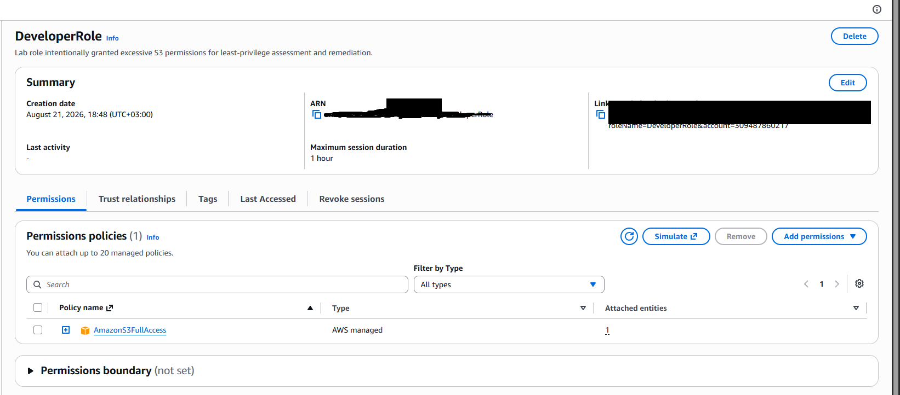
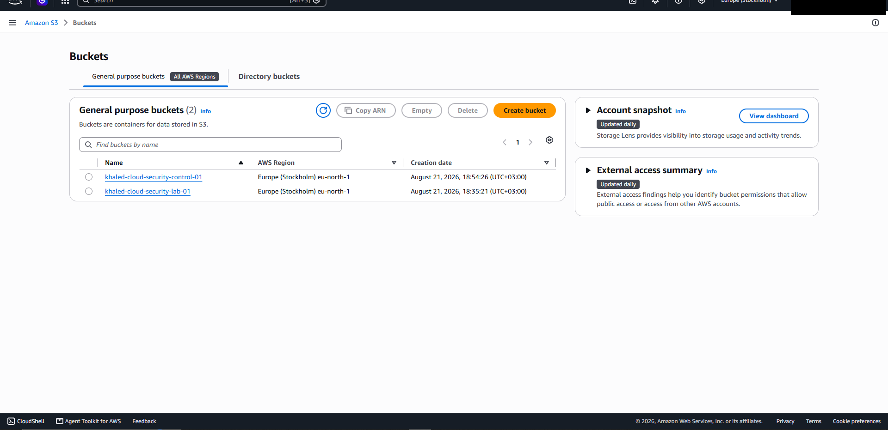
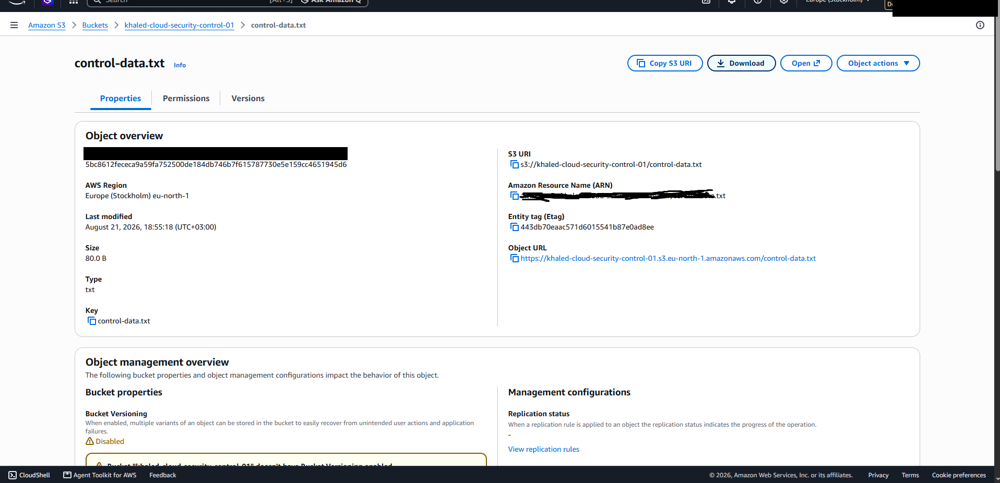
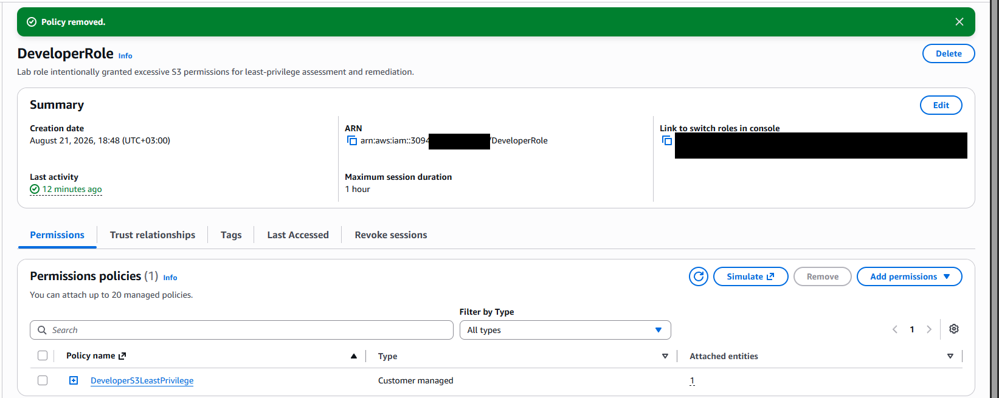
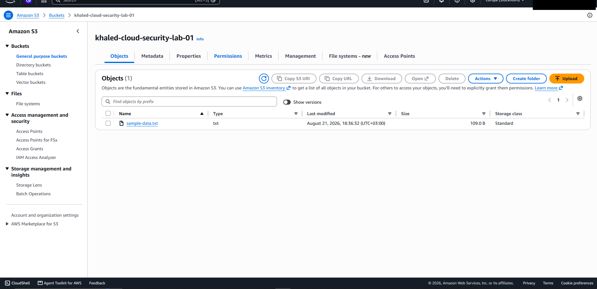
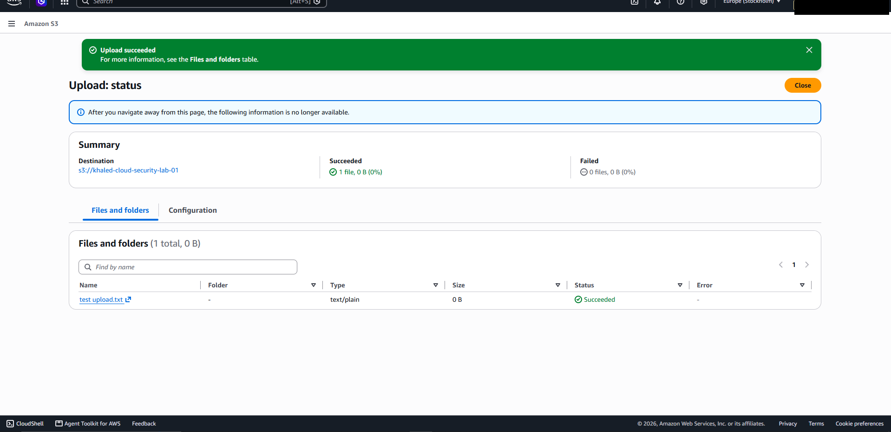
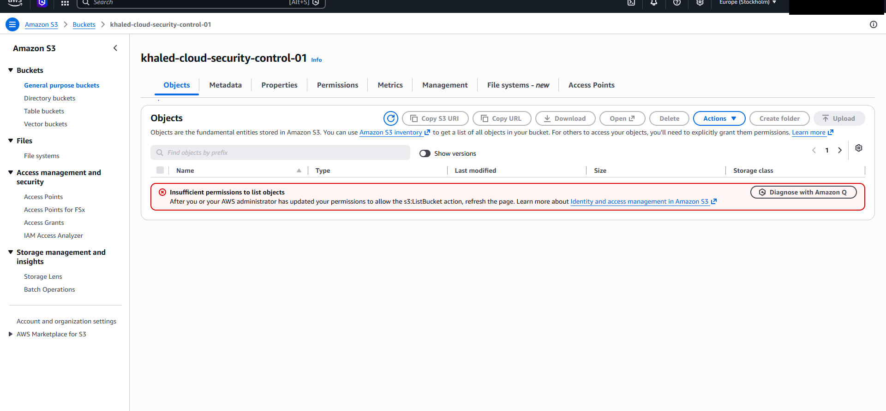

# AWS-01 — Excessive IAM Permissions Assigned to `DeveloperRole`

## Finding Information

| Field | Value |
|---|---|
| **Finding ID** | AWS-01 |
| **Category** | Identity and Access Management |
| **Severity** | High |
| **Status** | Remediated / Validated |
| **AWS Services** | IAM, Amazon S3 |
| **Date Identified** | 2026-08-21 |
| **Security Principle** | Least Privilege |

---

## Executive Summary

A cloud security assessment identified excessive Amazon S3 permissions assigned to the `DeveloperRole`.

The role was initially granted the AWS-managed `AmazonS3FullAccess` policy, allowing unrestricted S3 access across the AWS account. The intended requirement, however, was limited access to a single development bucket:

`khaled-cloud-security-lab-01`

Effective-access testing confirmed that the role could also enumerate and access a separate control bucket:

`khaled-cloud-security-control-01`

and access the object:

`control-data.txt`

This demonstrated a clear violation of the **principle of least privilege** and increased the potential blast radius if the role were compromised or misused.

The issue was remediated by removing `AmazonS3FullAccess` and replacing it with a custom policy named `DeveloperS3LeastPrivilege`, restricting the role to only the required S3 actions and the designated lab bucket.

Post-remediation testing confirmed that legitimate access to the development bucket continued to function while access to the control bucket was denied.

---

## Assessment Objective

The objective of this assessment was to determine whether the permissions assigned to `DeveloperRole` were appropriately scoped to its operational requirement.

The intended access model was:

```text
DeveloperRole
      |
      v
khaled-cloud-security-lab-01
```

The role required only the ability to:

- List the designated lab bucket
- Read objects from the designated lab bucket
- Upload objects to the designated lab bucket

It did **not** require access to other S3 buckets or account-wide S3 administration.

---

# 1. Initial Misconfiguration

The `DeveloperRole` was configured with the AWS-managed:

`AmazonS3FullAccess`

policy.

This resulted in substantially broader access than required.

### Before — Broad S3 Access



The role had an AWS-managed policy providing broad access rather than a resource-specific policy.

---

## 2. Effective Access Validation

The assessment did not rely only on the policy name. Effective permissions were tested directly by assuming `DeveloperRole` and attempting to access AWS S3 resources.

### Test 1 — Account-Wide Bucket Enumeration

While operating as `DeveloperRole`, both the intended development bucket and the unrelated control bucket were visible.



This demonstrated that the role was able to enumerate S3 resources outside its intended scope.

---

### Test 2 — Unauthorized-for-Business-Purpose Control Bucket Access

The role was then used to access:

`khaled-cloud-security-control-01/control-data.txt`

Although the data was synthetic and intentionally created for this lab, the control bucket represented a resource the developer role should not have needed.



The ability to access this object confirmed that the excessive permissions were **effective and exploitable**, rather than merely theoretical.

---

# 3. Technical Analysis

The original effective access model was:

```text
DeveloperRole
      |
      v
AmazonS3FullAccess
      |
      +--> khaled-cloud-security-lab-01
      |
      +--> khaled-cloud-security-control-01
      |
      +--> Other S3 resources in the account
```

The operational requirement was significantly narrower.

Granting broad S3 access unnecessarily increased the capabilities available to the role. If the role's session or credentials were compromised, the same over-permissioned access could increase attacker impact.

Potential consequences in a production environment could include:

- Unauthorized access to unrelated S3 data
- Modification of unrelated objects
- Deletion of data
- Creation or modification of S3 resources
- Increased blast radius following credential compromise
- Privacy or regulatory exposure
- Operational disruption

---

# 4. Risk Assessment

### Likelihood — Medium

The excessive permissions did not independently create a compromise path. However, they materially increased what an attacker or unauthorized user could do if the role were compromised or misused.

### Impact — High

The role had access to S3 resources outside its intended operational scope. In a production environment, this could expose unrelated or sensitive data and increase the impact of identity compromise.

### Overall Severity — High

The finding was rated **High** because the role had significantly broader permissions than required and this access was confirmed through direct effective-access testing.

---

# 5. Root Cause

The root cause was the use of a broad AWS-managed policy for convenience instead of a workload-specific least-privilege policy.

### Original Configuration

```text
DeveloperRole
      |
      v
AmazonS3FullAccess
      |
      v
All S3 Resources
```

This conflicted with the actual business requirement, which was limited to a single S3 bucket.

---

# 6. Remediation

A custom IAM policy named:

`DeveloperS3LeastPrivilege`

was created and attached to the role.

The broad `AmazonS3FullAccess` policy was then removed.

### Least-Privilege Policy

```json
{
  "Version": "2012-10-17",
  "Statement": [
    {
      "Sid": "ListRequiredBucket",
      "Effect": "Allow",
      "Action": [
        "s3:ListBucket",
        "s3:GetBucketLocation"
      ],
      "Resource": "arn:aws:s3:::khaled-cloud-security-lab-01"
    },
    {
      "Sid": "AccessRequiredObjects",
      "Effect": "Allow",
      "Action": [
        "s3:GetObject",
        "s3:PutObject"
      ],
      "Resource": "arn:aws:s3:::khaled-cloud-security-lab-01/*"
    }
  ]
}
```

The policy restricts access at two levels:

- **Bucket-level permissions** apply only to `khaled-cloud-security-lab-01`
- **Object-level permissions** apply only to objects within that bucket

No permissions are granted to the control bucket.

---

### After — Broad Policy Removed



The final role configuration contains only the custom `DeveloperS3LeastPrivilege` policy.

---

# 7. Post-Remediation Validation

Remediation was validated through direct effective-access testing.

## Test 1 — Intended Bucket Access

`DeveloperRole` retained access to:

`khaled-cloud-security-lab-01`



**Result:** ✅ Allowed

---

## Test 2 — Intended Object Upload

The role successfully uploaded a harmless test object to the intended lab bucket.



**Result:** ✅ Allowed

This confirmed that remediation did not unnecessarily break the required developer workflow.

---

## Test 3 — Control Bucket Access

The role was then directed to:

`khaled-cloud-security-control-01`

AWS returned:

**Insufficient permissions to list objects**



**Result:** ❌ Denied as intended

This confirmed that the role no longer had access to the unrelated control bucket.

---

# 8. Before vs. After

| Validation Test | Before | After |
|---|---:|---:|
| Access intended lab bucket | ✅ Allowed | ✅ Allowed |
| Read intended lab objects | ✅ Allowed | ✅ Allowed |
| Upload to intended lab bucket | ✅ Allowed | ✅ Allowed |
| Enumerate all S3 buckets | ✅ Allowed | ❌ Denied |
| Access control bucket | ✅ Allowed | ❌ Denied |
| Access `control-data.txt` | ✅ Allowed | ❌ Denied |
| Broad `AmazonS3FullAccess` attached | ✅ Yes | ❌ No |
| Resource-specific policy enforced | ❌ No | ✅ Yes |

---

# 9. Final Access Model

```text
DeveloperRole
      |
      v
DeveloperS3LeastPrivilege
      |
      +--> s3:ListBucket
      |      |
      |      +--> khaled-cloud-security-lab-01
      |
      +--> s3:GetObject
      +--> s3:PutObject
             |
             +--> khaled-cloud-security-lab-01/*

Control Bucket
      |
      +--> Access Denied
```

---

# 10. Validation Outcome

All remediation criteria were satisfied:

- [x] `DeveloperRole` retains access to the required lab bucket
- [x] `DeveloperRole` can read the required object
- [x] `DeveloperRole` can upload objects to the required bucket
- [x] `DeveloperRole` can no longer enumerate all S3 buckets
- [x] `DeveloperRole` cannot list the control bucket
- [x] `AmazonS3FullAccess` was removed
- [x] Custom resource-scoped permissions were implemented
- [x] Effective access was retested after remediation

### Final Status

**Remediated / Validated**

---

# 11. Security Principles Demonstrated

This assessment demonstrates practical application of:

- **Least Privilege**
- **Role-Based Access Control**
- **Blast-Radius Reduction**
- **Secure-by-Default Configuration**
- **Defense in Depth**
- **Effective-Permission Validation**
- **Security Remediation and Verification**

---

# 12. Lessons Learned

This assessment demonstrated that a role may function correctly while still being dangerously overprivileged.

Reviewing only the name of an attached policy is insufficient. Security assessments should compare effective permissions against the actual operational requirement.

The strongest validation came from testing both states:

```text
BEFORE
DeveloperRole
├── Intended lab bucket     ✅
└── Control bucket          ✅  Excessive Access

AFTER
DeveloperRole
├── Intended lab bucket     ✅
└── Control bucket          ❌  Access Denied
```

This before-and-after validation confirmed that least-privilege remediation reduced unnecessary access without disrupting required functionality.

---

## Evidence Index

| Evidence | Description |
|---|---|
| `01_before_AmazonS3FullAccess_attached.png` | `AmazonS3FullAccess` attached to `DeveloperRole` |
| `02_before_both_buckets_visible_as_DeveloperRole.png` | Both intended and control buckets visible |
| `03_before_control-data_accessible.png` | `control-data.txt` accessible before remediation |
| `04_after_DeveloperS3LeastPrivilege_only.png` | Only custom least-privilege policy remains |
| `05_after_intended_lab_bucket_accessible.png` | Intended bucket remains accessible |
| `06_after_upload_to_intended_bucket_succeeds.png` | Required upload operation succeeds |
| `07_after_control_bucket_access_denied.png` | Control bucket denied after remediation |

---

## Ethical Scope

All testing was performed within a personally controlled AWS lab environment using synthetic data.

No third-party systems, production systems, customer data, or unauthorized resources were accessed during this assessment.

Sensitive AWS account identifiers were removed from screenshots before publication.

---

## References

- AWS Identity and Access Management documentation
- AWS IAM security best practices
- AWS IAM policy documentation
- Amazon S3 authorization documentation
- AWS guidance on least-privilege permissions
