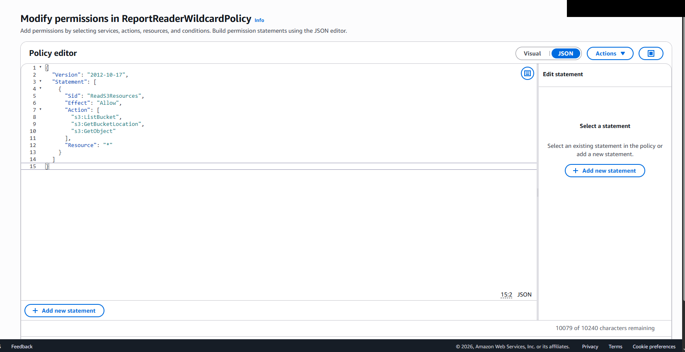
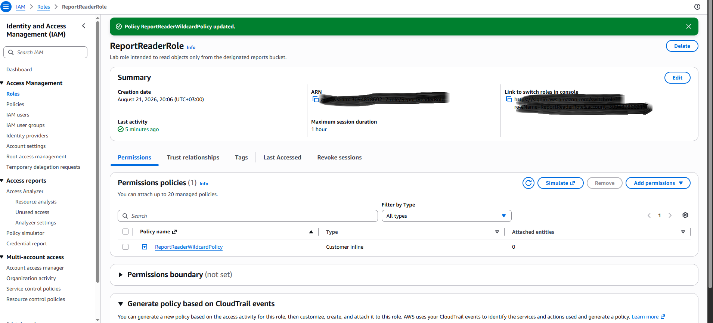
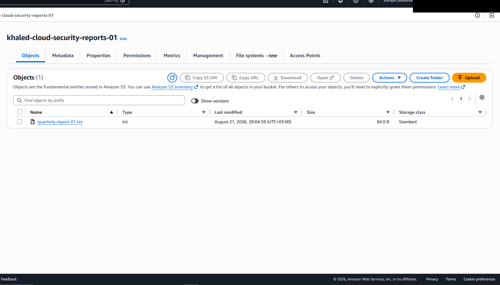
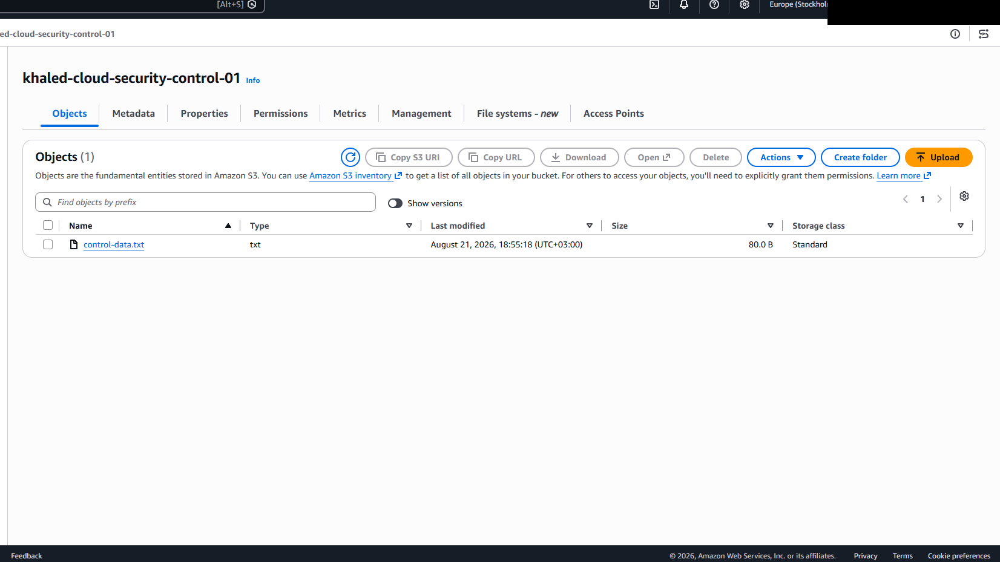
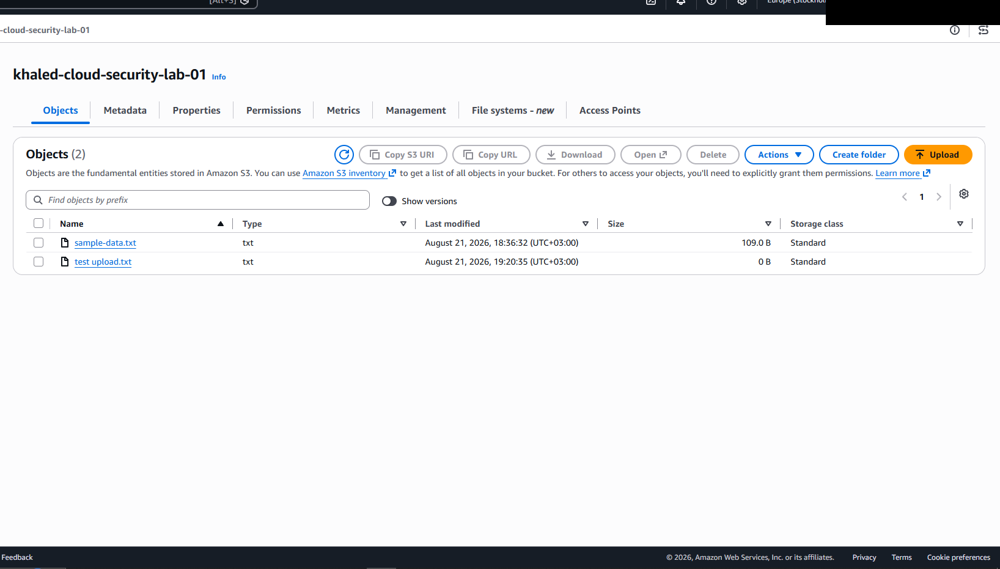
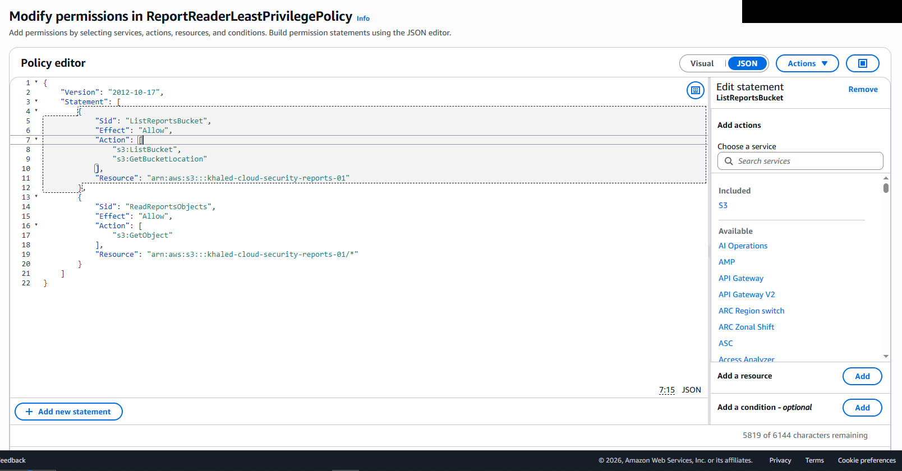
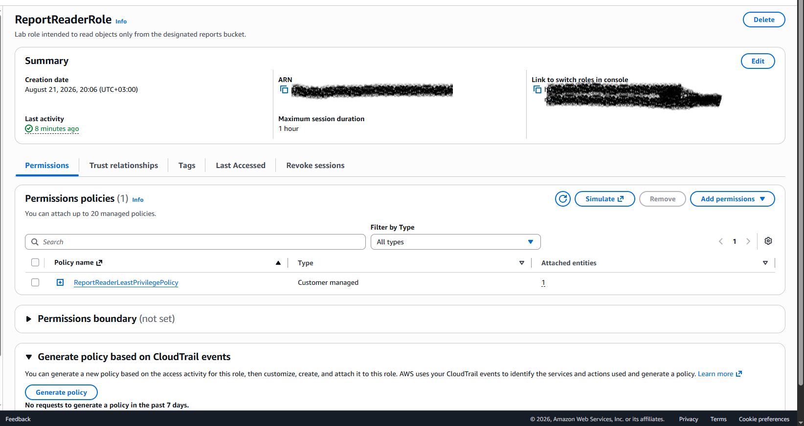
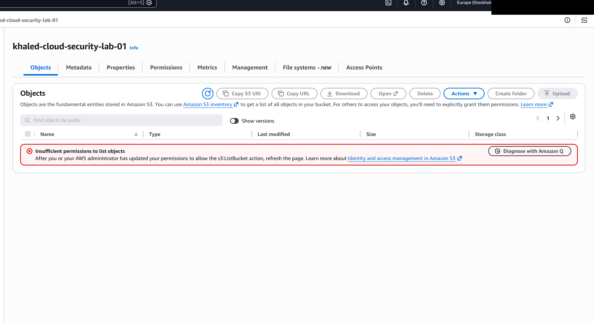
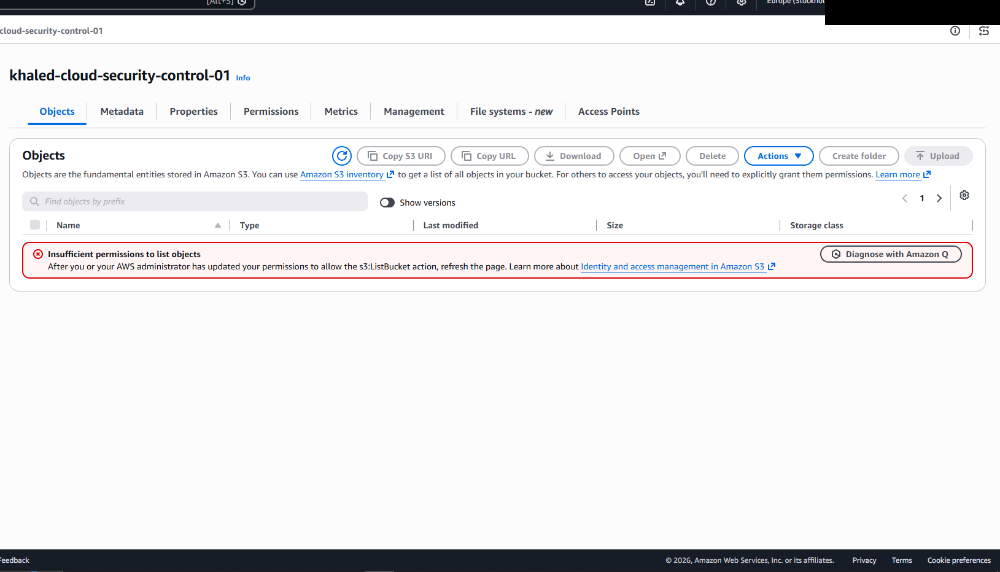
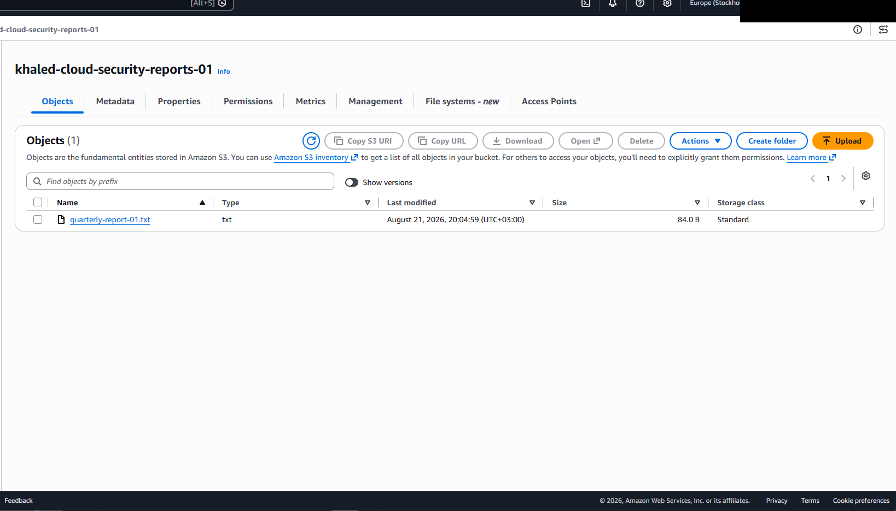

# AWS-02 — Wildcard Resource Permissions in `ReportReaderRole`

## Finding Information

| Field | Value |
|---|---|
| **Finding ID** | AWS-02 |
| **Category** | Identity and Access Management |
| **Severity** | High |
| **Status** | Remediated / Validated |
| **AWS Services** | IAM, Amazon S3 |
| **Date Identified** | 2026-08-21 |
| **Security Principle** | Resource-Level Least Privilege |

---

## Executive Summary

A cloud security assessment identified a custom IAM policy attached to `ReportReaderRole` that restricted the role to read-oriented S3 actions but granted those actions against a wildcard resource scope:

```json
"Resource": "*"
```

The intended requirement for the role was to read objects only from:

`khaled-cloud-security-reports-01`

However, effective-access testing demonstrated that the role could also list and read from unrelated S3 buckets, including:

- `khaled-cloud-security-control-01`
- `khaled-cloud-security-lab-01`

This represented a **resource-level least-privilege violation**. Although the allowed actions were more constrained than in AWS-01, the wildcard resource scope unnecessarily expanded the role's data-access boundary across unrelated S3 resources.

The issue was remediated by replacing the wildcard resource scope with explicit bucket and object ARNs limited to the designated reports bucket.

Post-remediation validation confirmed that required access to the reports bucket remained functional while access to the unrelated lab and control buckets was denied.

---

## 1. Intended Access Model

```text
ReportReaderRole
      |
      v
Read Only
      |
      v
khaled-cloud-security-reports-01
```

The role required only the ability to:

- list the designated reports bucket;
- determine the bucket location;
- read report objects.

It did not require access to unrelated S3 buckets.

---

## 2. Initial Misconfiguration

The custom `ReportReaderWildcardPolicy` granted:

```json
{
  "Version": "2012-10-17",
  "Statement": [
    {
      "Sid": "ReadS3Resources",
      "Effect": "Allow",
      "Action": [
        "s3:ListBucket",
        "s3:GetBucketLocation",
        "s3:GetObject"
      ],
      "Resource": "*"
    }
  ]
}
```

The actions were relatively constrained, but the wildcard resource scope caused those permissions to apply broadly.

### Evidence — Wildcard Resource Policy



---

## 3. Policy Assignment

The wildcard policy was attached to `ReportReaderRole`.



---

## 4. Effective Access Validation

### Test 1 — Intended Reports Bucket



**Result:** ✅ Expected

### Test 2 — Unrelated Control Bucket



**Result:** ❌ Excessive access

### Test 3 — Unrelated Lab Bucket



**Result:** ❌ Excessive access

---

## 5. Technical Analysis

The effective access model was:

```text
ReportReaderRole
      |
      v
ReadS3Resources
      |
      v
Resource: "*"
      |
      +--> Reports bucket   ✅ Intended
      +--> Control bucket   ❌ Excessive
      +--> Lab bucket       ❌ Excessive
```

The problem was the **resource boundary**, not simply the number of actions.

Using:

```json
"Resource": "*"
```

allowed the role to use its permitted S3 actions against unrelated resources outside its stated business requirement.

In a production environment, this could expose unrelated business, customer, operational, or regulated data.

---

## 6. Risk Assessment

### Likelihood — Medium

The wildcard resource scope does not independently cause compromise, but it significantly expands what the role can access if the identity is misused or compromised.

### Impact — High

Potential consequences include:

- unauthorized cross-bucket data access;
- disclosure of sensitive information;
- increased blast radius following identity compromise;
- segregation-of-duty violations;
- privacy or compliance exposure.

### Overall Severity — High

Direct testing confirmed that the wildcard scope produced real cross-bucket access beyond the role's stated requirement.

---

## 7. Root Cause

The root cause was an IAM policy that constrained actions but failed to constrain resources.

```text
ReportReaderRole
      |
      v
s3:ListBucket
s3:GetBucketLocation
s3:GetObject
      |
      v
Resource: "*"
```

This resulted in action-level restriction without resource-level restriction.

---

## 8. Remediation

The wildcard policy was replaced with a resource-scoped least-privilege policy:

`ReportReaderLeastPrivilegePolicy`

```json
{
  "Version": "2012-10-17",
  "Statement": [
    {
      "Sid": "ListReportsBucket",
      "Effect": "Allow",
      "Action": [
        "s3:ListBucket",
        "s3:GetBucketLocation"
      ],
      "Resource": "arn:aws:s3:::khaled-cloud-security-reports-01"
    },
    {
      "Sid": "ReadReportsObjects",
      "Effect": "Allow",
      "Action": [
        "s3:GetObject"
      ],
      "Resource": "arn:aws:s3:::khaled-cloud-security-reports-01/*"
    }
  ]
}
```

This separates bucket-level and object-level permissions and explicitly restricts both to the intended S3 resource.

### Evidence — Resource-Scoped Policy



---

## 9. Remediated Policy Assignment

`ReportReaderRole` was updated to use `ReportReaderLeastPrivilegePolicy`.



---

## 10. Post-Remediation Validation

### Test 1 — Lab Bucket



**Result:** ❌ Denied as intended

### Test 2 — Control Bucket



**Result:** ❌ Denied as intended

### Test 3 — Reports Bucket



**Result:** ✅ Allowed

The security control reduced unnecessary access without disrupting required role functionality.

---

## 11. Before vs. After

| Validation Test | Before | After |
|---|---:|---:|
| Access reports bucket | ✅ Allowed | ✅ Allowed |
| Read reports objects | ✅ Allowed | ✅ Allowed |
| Access control bucket | ✅ Allowed | ❌ Denied |
| Access lab bucket | ✅ Allowed | ❌ Denied |
| Wildcard resource scope | ✅ Present | ❌ Removed |
| Explicit resource ARNs | ❌ No | ✅ Yes |
| Required functionality retained | ✅ Yes | ✅ Yes |

---

## 12. Final Access Model

```text
ReportReaderRole
      |
      v
ReportReaderLeastPrivilegePolicy
      |
      +--> s3:ListBucket
      +--> s3:GetBucketLocation
      |      |
      |      +--> khaled-cloud-security-reports-01
      |
      +--> s3:GetObject
             |
             +--> khaled-cloud-security-reports-01/*

Unrelated Lab Bucket
      |
      +--> Access Denied

Unrelated Control Bucket
      |
      +--> Access Denied
```

---

## 13. Validation Outcome

- [x] Required reports-bucket access retained
- [x] Required report-object read access retained
- [x] Lab-bucket access denied
- [x] Control-bucket access denied
- [x] Wildcard resource scope removed
- [x] Explicit bucket ARN implemented
- [x] Explicit object ARN implemented
- [x] Effective access retested after remediation

### Final Status

**Remediated / Validated**

---

## 14. Security Principles Demonstrated

- **Least Privilege**
- **Resource-Level Authorization**
- **Role-Based Access Control**
- **Blast-Radius Reduction**
- **Segregation of Access**
- **Effective-Permission Validation**
- **Security Remediation and Verification**

---

## 15. Lessons Learned

AWS-02 demonstrates that restricting actions alone is not sufficient.

A policy can appear narrow because it allows only a small number of actions while still being dangerously overbroad if those actions apply to:

```json
"Resource": "*"
```

IAM privilege therefore needs to be evaluated across two dimensions:

```text
WHAT can the role do?
        +
WHERE can the role do it?
```

AWS-01 primarily demonstrated excessive action scope through a broad managed policy. AWS-02 demonstrates that **resource scope must also be explicitly constrained**.

```text
BEFORE
ReportReaderRole
├── Reports bucket    ✅ Intended
├── Control bucket    ✅ Excessive
└── Lab bucket        ✅ Excessive

AFTER
ReportReaderRole
├── Reports bucket    ✅ Intended
├── Control bucket    ❌ Denied
└── Lab bucket        ❌ Denied
```

---

## Evidence Index

| Evidence | Description |
|---|---|
| `01_before_wildcard_resource_policy.png` | Wildcard `"Resource": "*"` visible in policy |
| `02_before_policy_attached_to_ReportReaderRole.png` | Wildcard policy assigned to `ReportReaderRole` |
| `03_before_reports_bucket_access.png` | Intended reports bucket accessible |
| `04_before_control_bucket_excessive_access.png` | Unrelated control bucket accessible |
| `05_before_lab_bucket_excessive_access.png` | Unrelated lab bucket accessible |
| `06_after_resource_scoped_policy.png` | Resource-specific ARNs implemented |
| `07_after_least_privilege_policy_attached.png` | Least-privilege policy assigned |
| `08_after_lab_bucket_denied.png` | Unrelated lab bucket denied |
| `09_after_control_bucket_denied.png` | Unrelated control bucket denied |
| `10_after_reports_bucket_access_retained.png` | Required reports access retained |

---

## Ethical Scope

All testing was conducted in a personally controlled AWS lab environment using synthetic data and intentionally created test resources.

No production data, third-party systems, or unauthorized resources were accessed.

Sensitive AWS account identifiers were removed from screenshots before publication.
