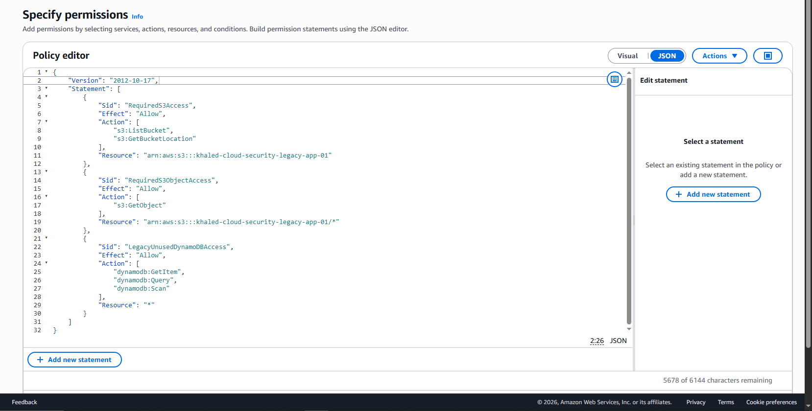
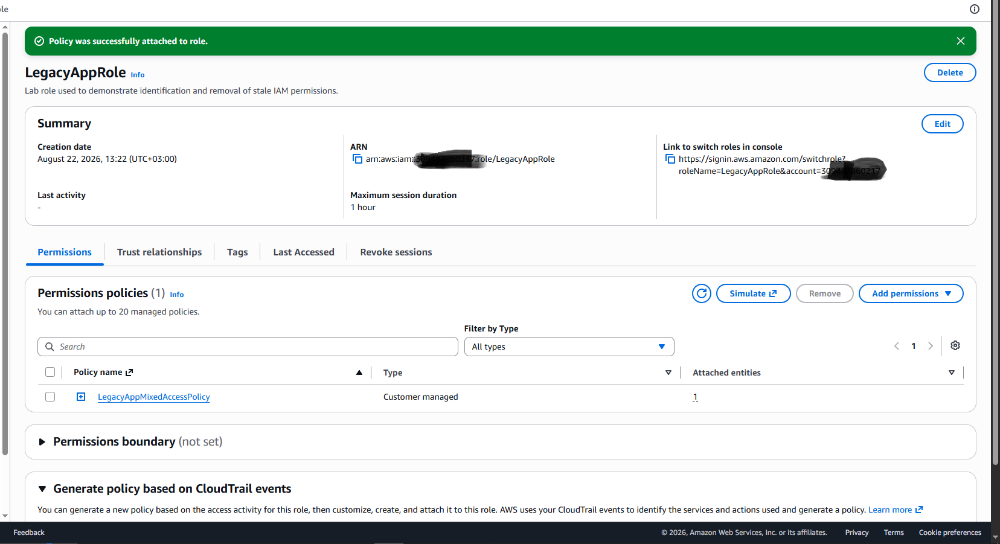
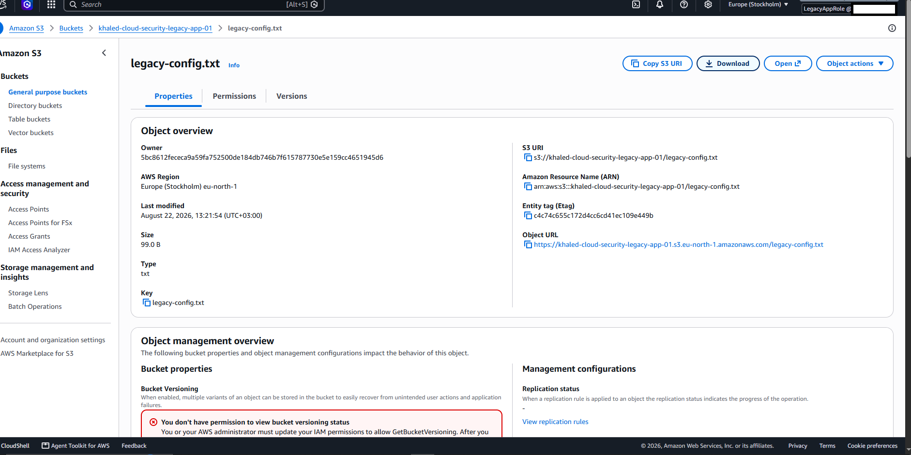
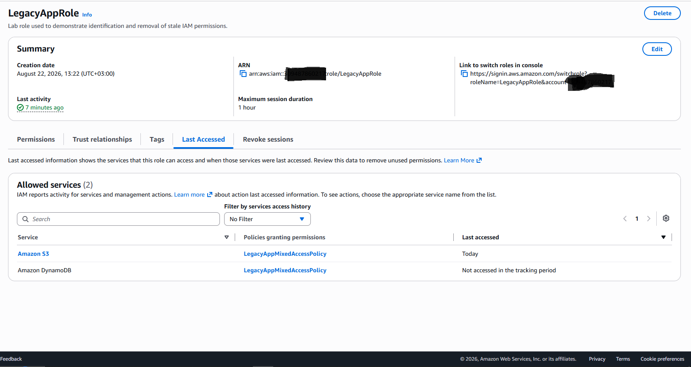
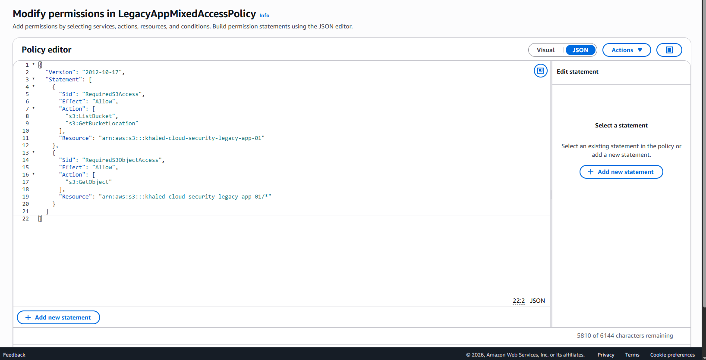
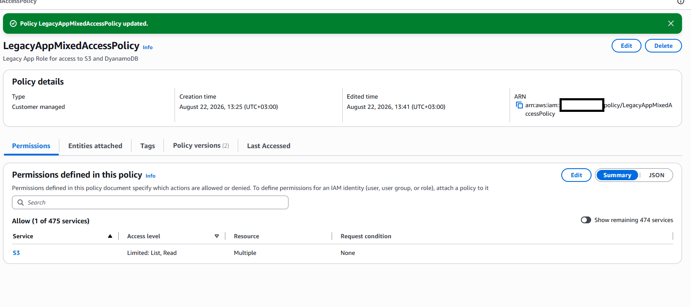
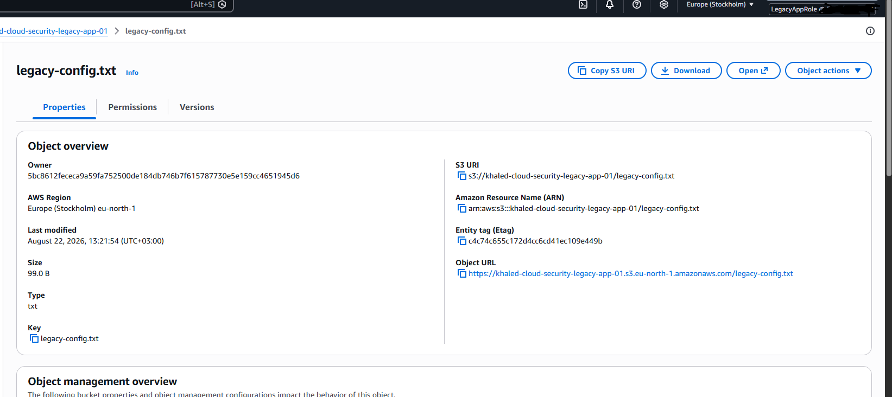
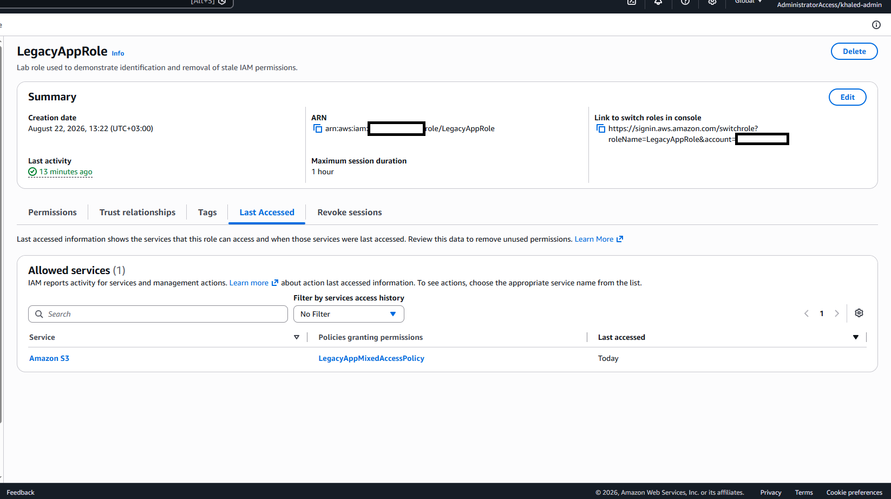

# AWS-03 — Stale IAM Permissions in `LegacyAppRole`

## Finding Information

| Field | Value |
|---|---|
| **Finding ID** | AWS-03 |
| **Category** | Identity and Access Management |
| **Severity** | Medium |
| **Status** | Remediated / Validated |
| **AWS Services** | IAM, Amazon S3, Amazon DynamoDB |
| **Date Identified** | 2026-08-22 |
| **Security Principle** | Least Privilege / Permission Lifecycle Management |

---

## Executive Summary

A cloud IAM review identified stale Amazon DynamoDB permissions assigned to `LegacyAppRole`.

The role's current business requirement was limited to read access against the designated S3 bucket:

`khaled-cloud-security-legacy-app-01`

However, the attached `LegacyAppMixedAccessPolicy` also granted DynamoDB read operations:

- `dynamodb:GetItem`
- `dynamodb:Query`
- `dynamodb:Scan`

The DynamoDB permissions represented historical access that was no longer required by the workload.

AWS IAM **Last Accessed** information showed:

- **Amazon S3 — Last accessed: Today**
- **Amazon DynamoDB — Not accessed in the tracking period**

This provided AWS-native evidence that the role actively used S3 while the DynamoDB entitlement remained unused.

The stale DynamoDB permissions were removed from the policy. Post-remediation testing confirmed that the role retained its required S3 access, and IAM subsequently showed only Amazon S3 as an allowed service.

---

## 1. Intended Access Model

```text
LegacyAppRole
      |
      v
Read-only access
      |
      v
khaled-cloud-security-legacy-app-01
```

The role required:

- `s3:ListBucket`
- `s3:GetBucketLocation`
- `s3:GetObject`

It did **not** require DynamoDB access.

---

## 2. Initial Policy State

The original `LegacyAppMixedAccessPolicy` combined required S3 permissions with stale DynamoDB permissions.

```json
{
  "Version": "2012-10-17",
  "Statement": [
    {
      "Sid": "RequiredS3Access",
      "Effect": "Allow",
      "Action": [
        "s3:ListBucket",
        "s3:GetBucketLocation"
      ],
      "Resource": "arn:aws:s3:::khaled-cloud-security-legacy-app-01"
    },
    {
      "Sid": "RequiredS3ObjectAccess",
      "Effect": "Allow",
      "Action": [
        "s3:GetObject"
      ],
      "Resource": "arn:aws:s3:::khaled-cloud-security-legacy-app-01/*"
    },
    {
      "Sid": "LegacyUnusedDynamoDBAccess",
      "Effect": "Allow",
      "Action": [
        "dynamodb:GetItem",
        "dynamodb:Query",
        "dynamodb:Scan"
      ],
      "Resource": "*"
    }
  ]
}
```

### Evidence — Mixed S3 and DynamoDB Permissions



---

## 3. Policy Assignment

The mixed-access policy was attached to `LegacyAppRole`.



---

## 4. Required S3 Functionality

While operating as `LegacyAppRole`, the role successfully accessed:

`khaled-cloud-security-legacy-app-01/legacy-config.txt`



**Result:** ✅ Required functionality confirmed

---

## 5. Last-Accessed Analysis

AWS IAM Last Accessed information was reviewed to compare granted permissions with observed service usage.



| Service | Access State |
|---|---|
| Amazon S3 | **Last accessed: Today** |
| Amazon DynamoDB | **Not accessed in the tracking period** |

This supported the conclusion that the DynamoDB permissions were stale and unnecessary for the role's current function.

---

## 6. Technical Analysis

The initial entitlement model was:

```text
LegacyAppRole
      |
      +--> Amazon S3
      |      |
      |      +--> Required ✅
      |
      +--> Amazon DynamoDB
             |
             +--> Not accessed ❌
             +--> No current business requirement ❌
```

Unlike AWS-01 and AWS-02, this finding was not primarily about unrestricted action scope or wildcard resource scope.

The security issue was **entitlement persistence**: permissions remained assigned after the workload no longer required them.

Unused permissions increase the available attack surface and may expand the capabilities of an attacker if the role is compromised.

---

## 7. Risk Assessment

### Likelihood — Low to Medium

The stale DynamoDB permissions did not create a direct compromise path by themselves. However, they increased the capabilities available to the role beyond its current requirement.

### Impact — Medium

If the role were compromised, an attacker could potentially use DynamoDB read operations that the legitimate workload did not need.

Potential consequences include:

- unauthorized access to DynamoDB records;
- unnecessary expansion of compromise scope;
- exposure of business data stored in DynamoDB;
- weakened separation of duties;
- accumulation of entitlement debt over time.

### Overall Severity — Medium

The finding was rated **Medium** because the unnecessary permissions expanded the role's access boundary, but no active misuse or production exposure was present in the controlled lab.

---

## 8. Root Cause

The root cause was incomplete permission lifecycle management.

The application's access requirements had changed, but obsolete permissions were not removed from the IAM policy.

```text
Historical Requirement
        |
        v
S3 + DynamoDB
        |
Application Change
        |
        v
S3 Only
        |
        X
Old DynamoDB Permissions Not Removed
```

This is a form of **privilege creep** or **entitlement drift**.

---

## 9. Remediation

The entire `LegacyUnusedDynamoDBAccess` statement was removed.

The final policy retained only the required S3 access:

```json
{
  "Version": "2012-10-17",
  "Statement": [
    {
      "Sid": "RequiredS3Access",
      "Effect": "Allow",
      "Action": [
        "s3:ListBucket",
        "s3:GetBucketLocation"
      ],
      "Resource": "arn:aws:s3:::khaled-cloud-security-legacy-app-01"
    },
    {
      "Sid": "RequiredS3ObjectAccess",
      "Effect": "Allow",
      "Action": [
        "s3:GetObject"
      ],
      "Resource": "arn:aws:s3:::khaled-cloud-security-legacy-app-01/*"
    }
  ]
}
```

### Evidence — DynamoDB Permissions Removed



---

## 10. Remediated Policy Summary

AWS IAM subsequently showed the policy granting access to only one AWS service: Amazon S3.



---

## 11. Required Functionality Retest

After remediation, `LegacyAppRole` was used again to access:

`legacy-config.txt`



**Result:** ✅ Allowed

---

## 12. Post-Remediation Last-Accessed State

IAM Last Accessed information was reviewed again after remediation.



The role now showed:

- **Allowed services: 1**
- **Amazon S3 — Last accessed: Today**
- **Amazon DynamoDB — no longer present**

This confirmed that the stale DynamoDB entitlement had been removed from the role's effective service permissions.

---

## 13. Before vs. After

| Validation Item | Before | After |
|---|---:|---:|
| Required S3 access | ✅ Allowed | ✅ Allowed |
| S3 observed as used | ✅ Yes | ✅ Yes |
| DynamoDB permission present | ✅ Yes | ❌ No |
| DynamoDB observed as used | ❌ No | N/A |
| Number of allowed AWS services | 2 | 1 |
| Required functionality preserved | ✅ Yes | ✅ Yes |

---

## 14. Final Access Model

```text
LegacyAppRole
      |
      v
S3-only access
      |
      +--> s3:ListBucket
      +--> s3:GetBucketLocation
      +--> s3:GetObject
             |
             +--> khaled-cloud-security-legacy-app-01

Amazon DynamoDB
      |
      +--> No permission
```

---

## 15. Validation Outcome

- [x] Required S3 access identified
- [x] S3 usage confirmed through IAM Last Accessed
- [x] DynamoDB shown as unused
- [x] Stale DynamoDB entitlement removed
- [x] Required S3 functionality retained
- [x] IAM allowed-service count reduced from 2 to 1
- [x] Post-remediation access state validated

### Final Status

**Remediated / Validated**

---

## 16. Security Principles Demonstrated

- **Least Privilege**
- **Permission Lifecycle Management**
- **Privilege Creep Detection**
- **Entitlement Review**
- **Access Recertification**
- **Attack-Surface Reduction**
- **Effective-Permission Validation**
- **Security Remediation and Verification**

---

## 17. Lessons Learned

AWS-03 demonstrates that IAM security is not only about how broadly a policy is written when it is created.

Permissions should also be reviewed over time against actual business and workload requirements.

A permission can be syntactically valid, properly scoped, and still be unnecessary.

The key question becomes:

```text
Is this permission still required?
```

AWS IAM Last Accessed information provided useful supporting evidence by showing:

```text
Amazon S3        -> Used
Amazon DynamoDB  -> Not accessed
```

The remediation reduced the role's entitlement surface without affecting the workload's required S3 functionality.

---

## Evidence Index

| Evidence | Description |
|---|---|
| `01_before_mixed_s3_dynamodb_policy.png` | Mixed S3 and DynamoDB permissions |
| `02_before_mixed_policy_attached_to_LegacyAppRole.png` | Mixed policy attached to `LegacyAppRole` |
| `03_before_required_s3_access_success.png` | Required S3 object access succeeds |
| `04_before_last_accessed_s3_used_dynamodb_unused.png` | IAM Last Accessed shows S3 used and DynamoDB unused |
| `05_after_dynamodb_permissions_removed.png` | DynamoDB statement removed |
| `06_after_s3_only_policy_summary.png` | Policy summary shows only Amazon S3 |
| `07_after_required_s3_access_retained.png` | Required S3 access retained after remediation |
| `08_after_dynamodb_service_removed.png` | IAM Last Accessed shows only Amazon S3 as an allowed service |

---

## Ethical Scope

All testing was performed within a personally controlled AWS lab environment using synthetic data.

No production systems, third-party resources, customer data, or unauthorized systems were accessed.
