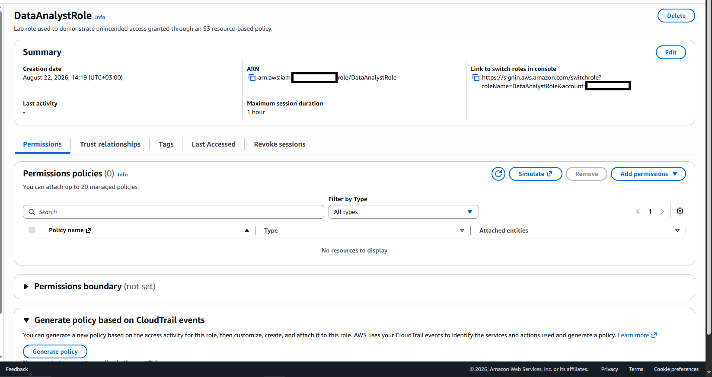
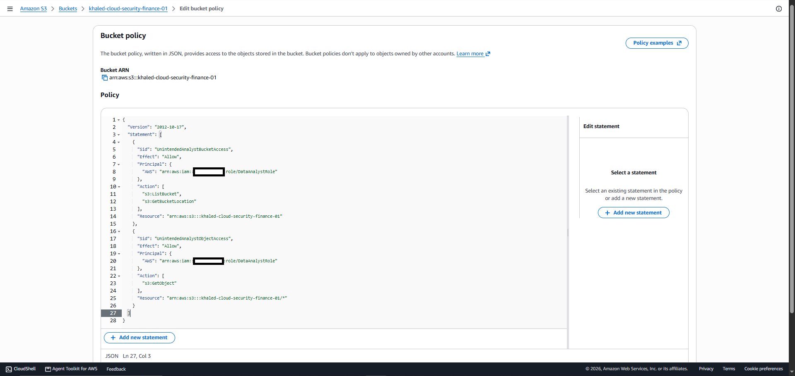
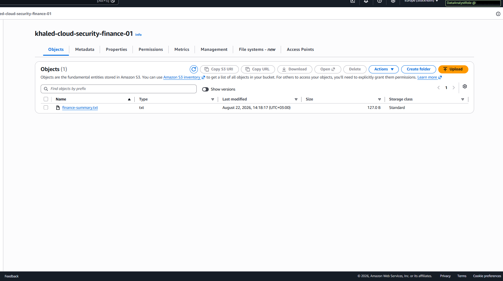
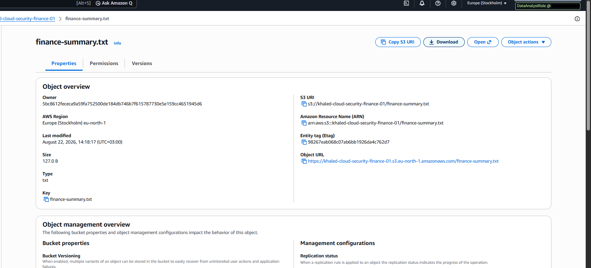
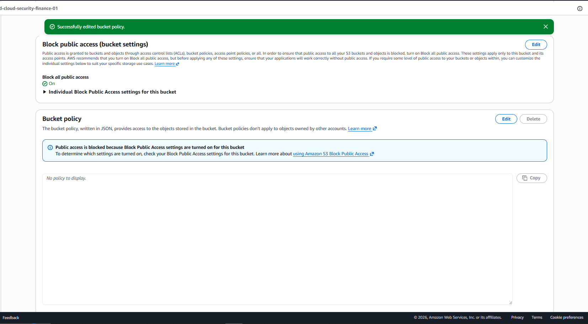
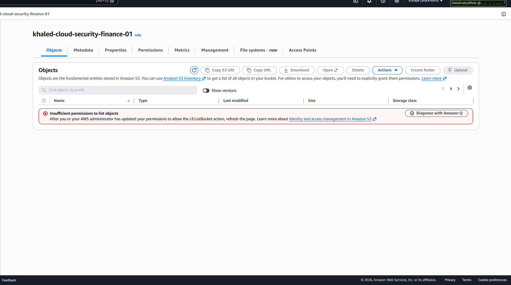
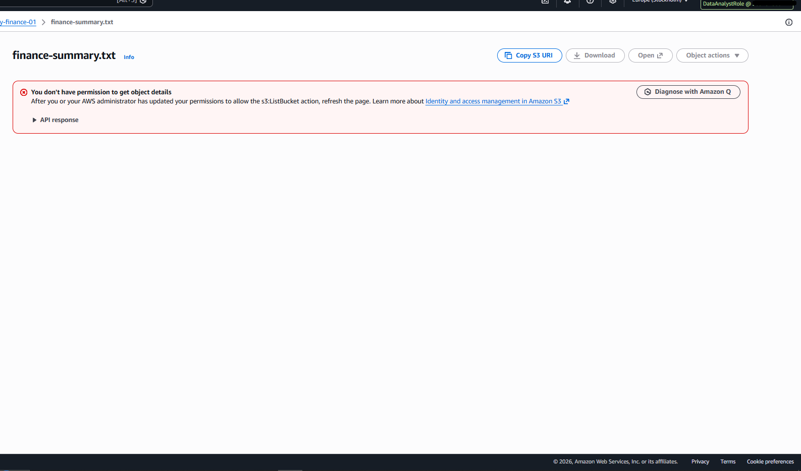
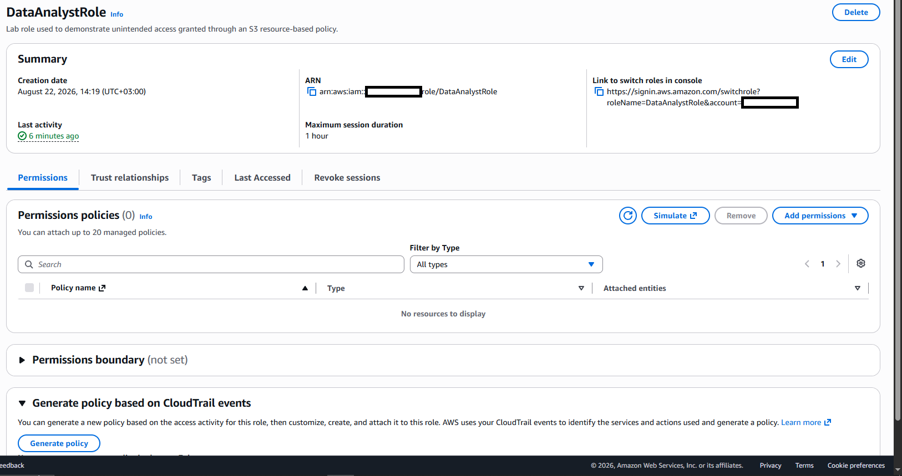

# AWS-04 — Unintended S3 Access Through a Resource-Based Bucket Policy

## Finding Information

| Field | Value |
|---|---|
| **Finding ID** | AWS-04 |
| **Category** | Resource-Based Authorization / Access Control |
| **Severity** | High |
| **Status** | Remediated / Validated |
| **AWS Services** | IAM, Amazon S3 |
| **Date Identified** | 2026-08-22 |
| **Security Principle** | Least Privilege / Effective Authorization Review |

---

## Executive Summary

A cloud security assessment identified unintended access to the finance S3 bucket `khaled-cloud-security-finance-01`.

The IAM role `DataAnalystRole` had **no attached S3 identity-based permission policies**. However, the S3 bucket policy explicitly granted the role permission to list the bucket and read objects.

Effective-access testing confirmed that the role could list the finance bucket and access `finance-summary.txt`.

This demonstrated that reviewing IAM identity policies alone is insufficient when evaluating AWS authorization. The role's access originated from the **resource-based S3 bucket policy**.

The issue was remediated by removing the unintended bucket policy. Post-remediation testing confirmed that `DataAnalystRole` still had zero attached permission policies and could no longer list the finance bucket or access the finance object.

---

## 1. Intended Access Model

```text
DataAnalystRole
      |
      X
khaled-cloud-security-finance-01
```

`DataAnalystRole` was not intended to access the finance bucket or its contents.

---

## 2. Identity-Based Permission Review

Before testing the bucket policy, the IAM role was reviewed.

`DataAnalystRole` had:

**Permissions policies (0)**



This established that the role did not receive S3 access through an attached identity-based IAM policy.

---

## 3. Resource-Based Policy Misconfiguration

The finance bucket contained a resource-based policy explicitly granting `DataAnalystRole` access.

### Bucket-Level Access

```json
{
  "Sid": "UnintendedAnalystBucketAccess",
  "Effect": "Allow",
  "Principal": {
    "AWS": "arn:aws:iam::<ACCOUNT-ID>:role/DataAnalystRole"
  },
  "Action": [
    "s3:ListBucket",
    "s3:GetBucketLocation"
  ],
  "Resource": "arn:aws:s3:::khaled-cloud-security-finance-01"
}
```

### Object-Level Access

```json
{
  "Sid": "UnintendedAnalystObjectAccess",
  "Effect": "Allow",
  "Principal": {
    "AWS": "arn:aws:iam::<ACCOUNT-ID>:role/DataAnalystRole"
  },
  "Action": [
    "s3:GetObject"
  ],
  "Resource": "arn:aws:s3:::khaled-cloud-security-finance-01/*"
}
```



---

## 4. Effective Access Validation

### Test 1 — Finance Bucket Listing

While operating as `DataAnalystRole`, the finance bucket was accessible.



**Result:** ❌ Unintended access confirmed

### Test 2 — Finance Object Access

The role was also able to access `finance-summary.txt`.



**Result:** ❌ Unintended object access confirmed

---

## 5. Technical Analysis

The effective authorization path was:

```text
DataAnalystRole
      |
      | Identity-based S3 policies: NONE
      |
      v
S3 bucket resource policy
      |
      +--> s3:ListBucket
      +--> s3:GetBucketLocation
      +--> s3:GetObject
              |
              v
khaled-cloud-security-finance-01
```

The role appeared unprivileged when viewed only from its IAM permissions page, but the S3 bucket policy created an independent authorization path.

This illustrates a core AWS authorization concept:

```text
Effective Access
      =
Identity-Based Policies
      +
Resource-Based Policies
      +
Other applicable policy layers
```

---

## 6. Risk Assessment

### Likelihood — Medium

The bucket policy explicitly granted the role access. Any user or workload able to assume `DataAnalystRole` could potentially access the finance bucket.

### Impact — High

In a production environment, unintended access to finance data could lead to:

- unauthorized disclosure of financial information;
- cross-functional data exposure;
- segregation-of-duty violations;
- privacy or regulatory impact;
- increased blast radius following role compromise.

### Overall Severity — High

The finding was rated **High** because direct testing confirmed that an unintended principal could access a finance data resource through a resource-based policy.

---

## 7. Root Cause

The root cause was an incorrect principal assignment in the S3 bucket policy.

```text
Finance Bucket
      |
      +--> Intended principals
      |
      +--> DataAnalystRole  ❌ Unintended
```

The access was not visible from the role's attached IAM permissions because it originated at the resource layer.

---

## 8. Remediation

The bucket-policy statements granting access to `DataAnalystRole` were removed.

Because the lab bucket had no other required bucket-policy statements, the resulting state contained no bucket policy.



S3 Block Public Access remained enabled.

---

## 9. Identity-Permission Validation

After remediation, `DataAnalystRole` was reviewed again.

It continued to have:

**Permissions policies (0)**



This confirmed that no compensating S3 identity policy was introduced during remediation.

---

## 10. Post-Remediation Validation

### Test 1 — Finance Bucket Access

After removal of the resource-based policy, `DataAnalystRole` was used to access the finance bucket again.

AWS returned:

**Insufficient permissions to list objects**



**Result:** ✅ Denied as intended

### Test 2 — Finance Object Access

The role was then directed to `finance-summary.txt`.

AWS returned an authorization error and the object details were unavailable.



**Result:** ✅ Denied as intended

---

## 11. Before vs. After

| Validation Item | Before | After |
|---|---:|---:|
| Attached S3 identity policy | ❌ None | ❌ None |
| Bucket policy grants `DataAnalystRole` | ✅ Yes | ❌ No |
| Finance bucket listing | ✅ Allowed | ❌ Denied |
| Finance object access | ✅ Allowed | ❌ Denied |
| Block Public Access | ✅ Enabled | ✅ Enabled |
| Unintended authorization path | ✅ Present | ❌ Removed |

---

## 12. Final Access Model

```text
BEFORE

DataAnalystRole
      |
      | IAM S3 policies: NONE
      |
      v
Finance Bucket Policy
      |
      +--> ListBucket ✅
      +--> GetObject ✅


AFTER

DataAnalystRole
      |
      | IAM S3 policies: NONE
      |
      X
Finance Bucket
      |
      +--> Access Denied
```

---

## 13. Validation Outcome

- [x] Confirmed zero S3 identity-based policies on `DataAnalystRole`
- [x] Identified the resource-based S3 authorization path
- [x] Confirmed bucket listing through the unintended policy
- [x] Confirmed object access through the unintended policy
- [x] Removed the unintended bucket-policy statements
- [x] Confirmed identity-policy state remained unchanged
- [x] Confirmed bucket access was denied after remediation
- [x] Confirmed object access was denied after remediation

### Final Status

**Remediated / Validated**

---

## 14. Security Principles Demonstrated

- **Least Privilege**
- **Resource-Based Authorization Review**
- **Effective Permission Analysis**
- **Principal Validation**
- **Segregation of Duties**
- **Attack-Surface Reduction**
- **Security Remediation and Verification**

---

## 15. Lessons Learned

AWS-04 demonstrates that an IAM role with no attached S3 policy can still have meaningful S3 access.

```text
No attached IAM policy
        does not mean
No effective access
```

A complete AWS access review should consider identity-based IAM policies, resource-based policies, permissions boundaries, service control policies, session policies, explicit denies, and other applicable authorization layers.

The before-and-after testing confirmed that the unintended authorization originated from the bucket policy and disappeared when that policy was removed.

---

## Evidence Index

| Evidence | Description |
|---|---|
| `01_before_DataAnalystRole_no_s3_permissions.png` | Role has zero attached permission policies |
| `02_before_bucket_policy_grants_DataAnalystRole.png` | S3 bucket policy explicitly grants the role access |
| `03_before_finance_bucket_access_success.png` | Role can list the finance bucket |
| `04_before_finance_object_access_success.png` | Role can access `finance-summary.txt` |
| `05_after_unintended_bucket_policy_removed.png` | Unintended bucket policy removed |
| `06_after_DataAnalystRole_still_no_s3_identity_policy.png` | Role still has zero attached permission policies |
| `07_after_finance_bucket_access_denied.png` | Finance bucket access denied |
| `08_after_finance_object_access_denied.png` | Finance object access denied |

---

## Ethical Scope

All testing was conducted in a personally controlled AWS lab environment using synthetic finance data.

The bucket remained private throughout the exercise, and S3 Block Public Access remained enabled.

No public exposure, third-party systems, production systems, customer information, or unauthorized resources were involved.
