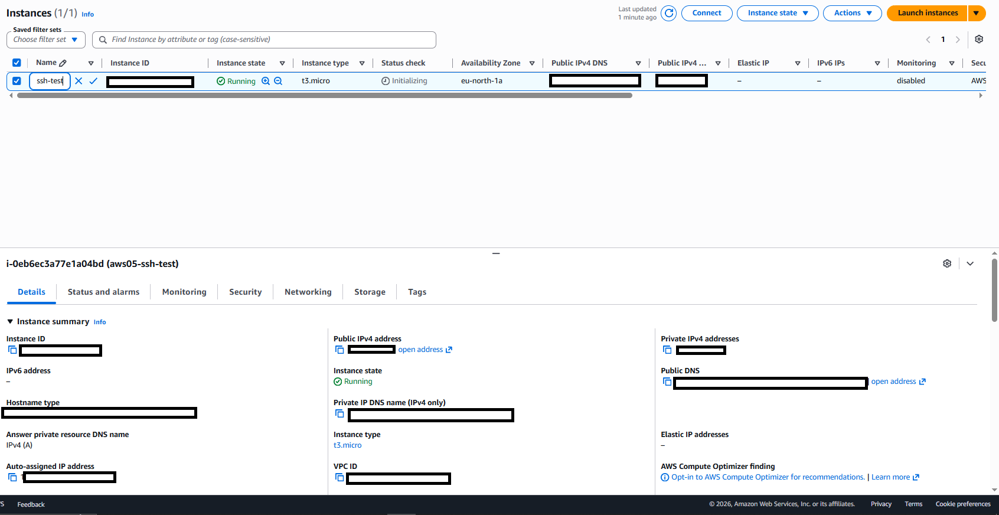
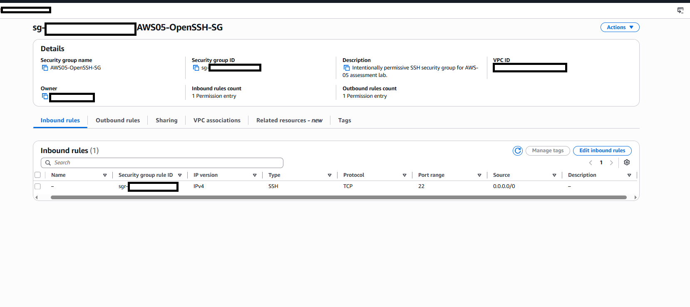
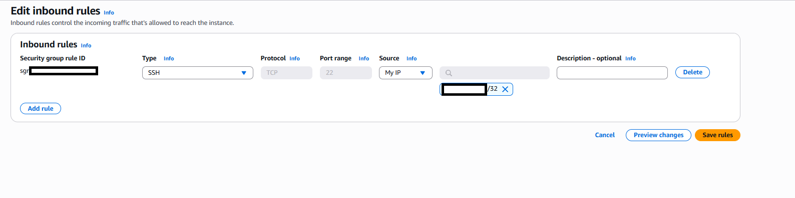
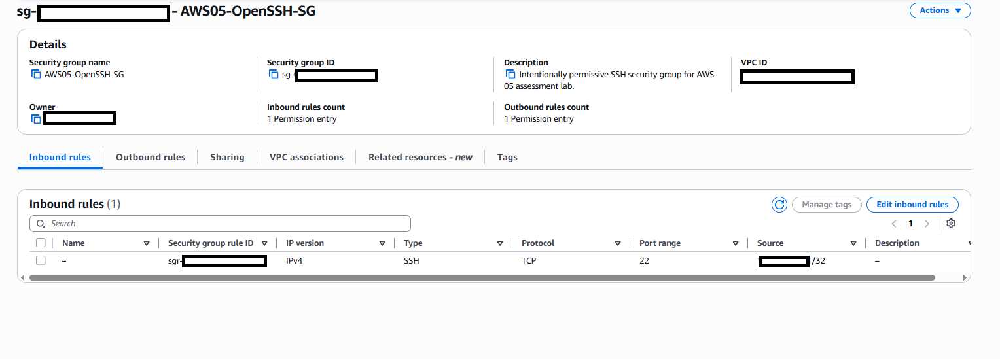
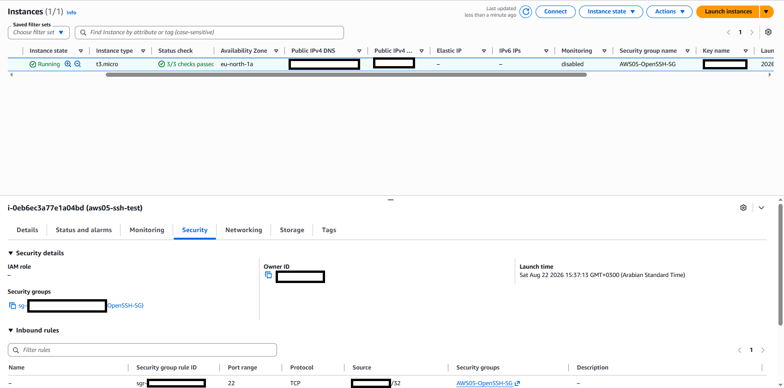

# AWS-05 — Overly Permissive Security Group Exposing SSH to the Internet

## Finding Information

| Field | Value |
|---|---|
| **Finding ID** | AWS-05 |
| **Category** | Network Security / EC2 Security Groups |
| **Severity** | High |
| **Status** | Remediated / Validated |
| **AWS Services** | Amazon EC2, VPC Security Groups |
| **Date Identified** | 2026-08-22 |
| **Security Principle** | Network Least Privilege / Attack-Surface Reduction |

---

## Executive Summary

A cloud security assessment identified an EC2 security group, `AWS05-OpenSSH-SG`, that allowed inbound SSH access on TCP port 22 from `0.0.0.0/0`.

The rule was attached to the publicly addressed EC2 instance `aws05-ssh-test`, permitting any IPv4 source on the internet to attempt an SSH connection.

The issue was remediated by replacing the world-open source with a single trusted administrative IPv4 address using a `/32` CIDR. Post-remediation validation confirmed that TCP/22 remained available only to the trusted source and that the same remediated security group remained attached to the instance.

---

## 1. Initial Exposure

The EC2 instance was running with a public IPv4 address and the security group `AWS05-OpenSSH-SG`.



The inbound security-group rule allowed:

```text
Type: SSH
Protocol: TCP
Port: 22
Source: 0.0.0.0/0
```



This created the following exposure:

```text
Internet
0.0.0.0/0
    |
    v
TCP 22
    |
    v
AWS05-OpenSSH-SG
    |
    v
aws05-ssh-test
```

---

## 2. Risk Assessment

### Likelihood — Medium

Publicly exposed SSH services are commonly discovered by automated scanning and may receive repeated unauthorized connection attempts.

### Impact — High

A successful compromise of an administrative service could lead to remote command execution, credential theft, persistence, lateral movement, data exposure, or workload disruption.

### Overall Severity — High

The finding was rated **High** because an administrative protocol was exposed to all IPv4 sources on a publicly addressed EC2 instance.

---

## 3. Root Cause

The inbound rule used an unnecessarily broad source CIDR:

```text
0.0.0.0/0
```

The service itself was required, but access from the entire internet was not.

---

## 4. Remediation

The SSH source was changed from `0.0.0.0/0` to a single trusted `/32` source.



The saved inbound rule was then verified.



The EC2 instance was also reviewed to confirm that the same remediated security group remained attached.



---

## 5. Before vs. After

| Validation Item | Before | After |
|---|---:|---:|
| EC2 instance publicly addressed | ✅ Yes | ✅ Yes |
| Security group attached | ✅ Yes | ✅ Yes |
| SSH TCP/22 allowed | ✅ Yes | ✅ Yes |
| SSH source `0.0.0.0/0` | ✅ Yes | ❌ No |
| SSH source restricted to `/32` | ❌ No | ✅ Yes |
| Internet-wide SSH exposure | ✅ Present | ❌ Removed |
| Required administrative path retained | ✅ Yes | ✅ Yes |

---

## 6. Final Network Access Model

```text
BEFORE

Internet
0.0.0.0/0
    |
    v
TCP 22
    |
    v
aws05-ssh-test


AFTER

Trusted Administrator
x.x.x.x/32
    |
    v
TCP 22
    |
    v
aws05-ssh-test

All other IPv4 sources
    |
    X
```

---

## 7. Validation Outcome

- [x] Public EC2 instance identified
- [x] World-open SSH rule confirmed
- [x] `0.0.0.0/0` removed
- [x] SSH restricted to one `/32` source
- [x] Final inbound rule verified
- [x] Remediated security group confirmed on the EC2 instance
- [x] Required SSH capability retained for the trusted source

### Final Status

**Remediated / Validated**

---

## 8. Security Principles Demonstrated

- Network Least Privilege
- Attack-Surface Reduction
- Security Group Review
- Management-Plane Protection
- Source Restriction
- Defense in Depth
- Remediation Validation

---

## 9. Lessons Learned

AWS-05 demonstrates that a required management service does not need to be reachable from every network source.

```text
Service required
      does not mean
Service required from everywhere
```

Restricting SSH from `0.0.0.0/0` to a single trusted `/32` source materially reduces the attack surface while preserving the required administrative path.

For higher-security environments, AWS Systems Manager Session Manager can further reduce exposure by eliminating the need for inbound SSH.

---

## Evidence Index

| Evidence | Description |
|---|---|
| `01_before_public_ec2_instance_details.png` | Public EC2 instance details |
| `02_before_ssh_open_to_world.png` | SSH TCP/22 allowed from `0.0.0.0/0` |
| `03_after_ssh_restricted_to_trusted_ip.png` | SSH source narrowed to a trusted `/32` |
| `04_after_security_group_rule_verified.png` | Final security-group inbound rule |
| `05_after_instance_uses_remediated_security_group.png` | Instance remains associated with the remediated security group |

---

## Ethical Scope

All testing was performed in a personally controlled AWS lab environment.

No unauthorized systems were scanned or accessed. The finding was validated through AWS configuration review and controlled remediation rather than external internet scanning.

Before publication, environment-specific identifiers such as public IP addresses, account IDs, instance IDs, VPC IDs, security-group IDs, and public DNS names should be sanitized.
