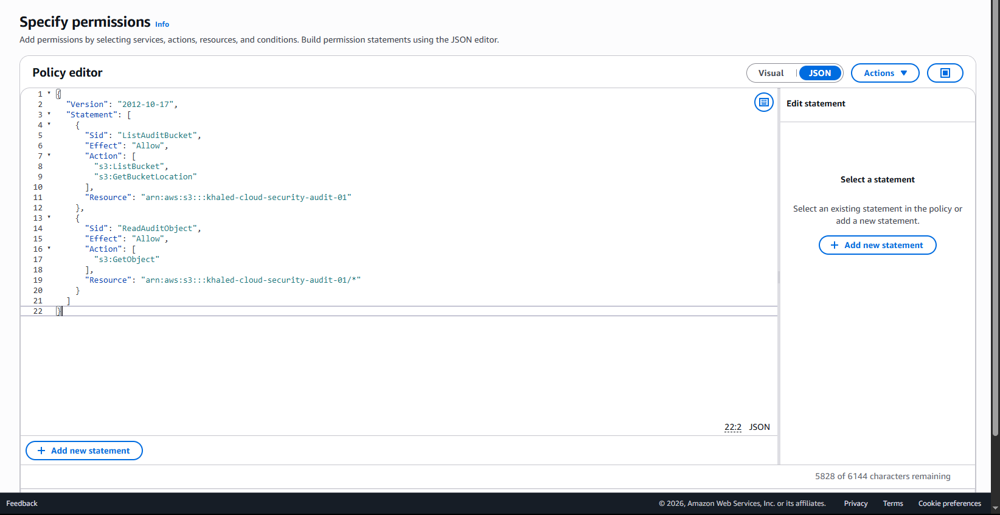
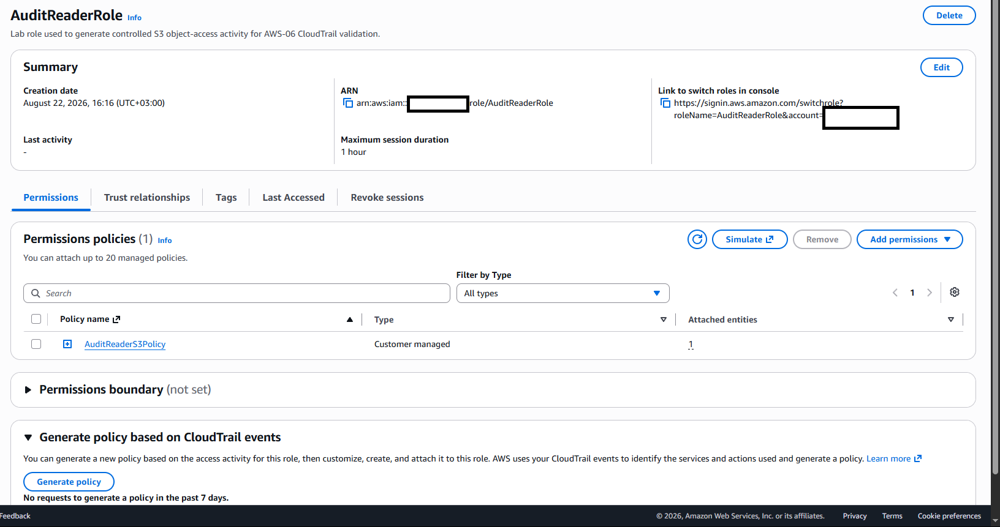
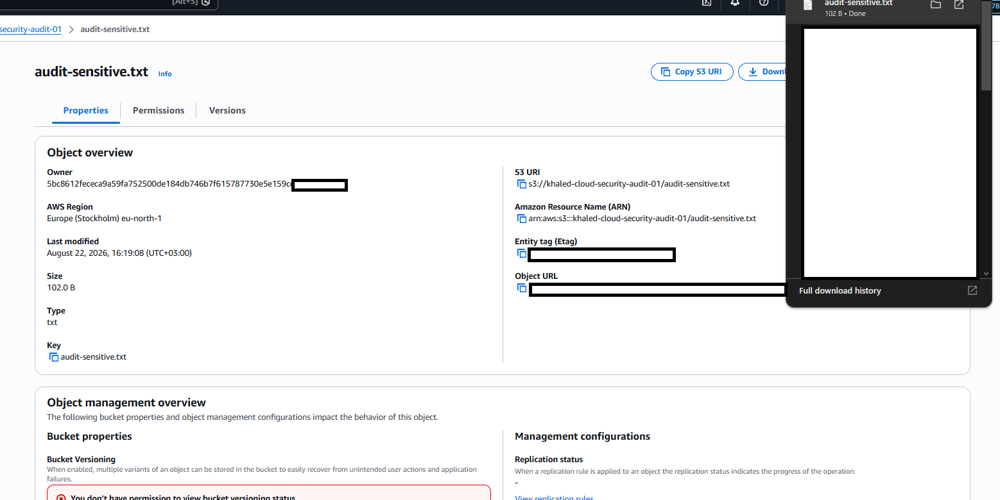
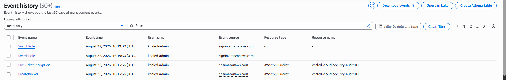
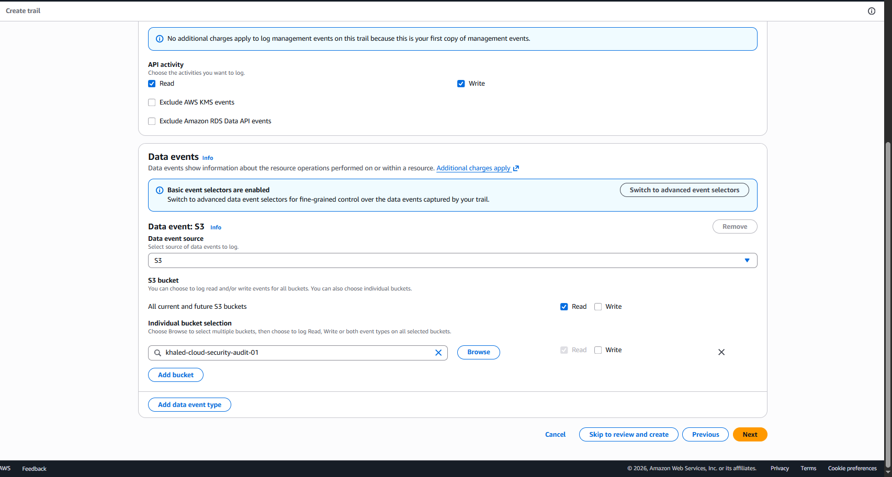
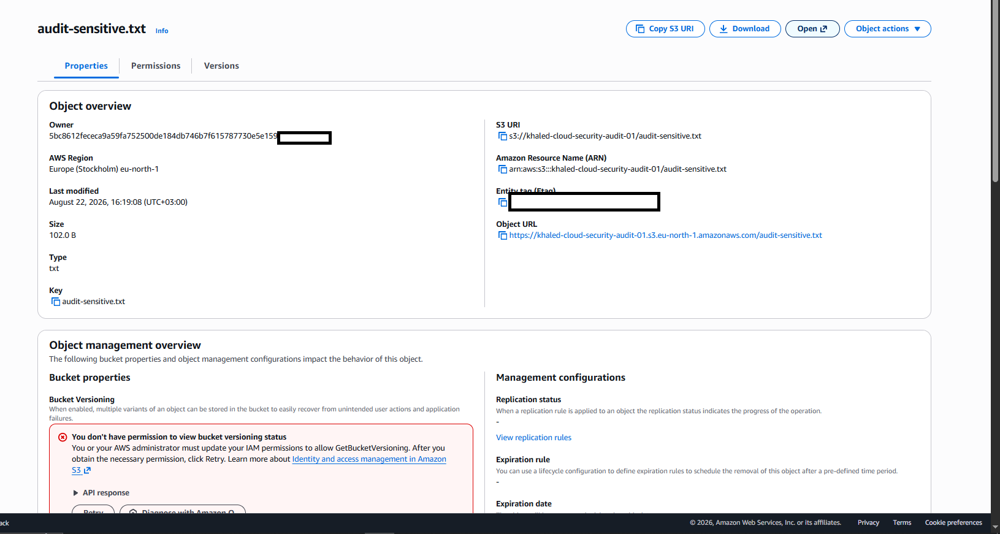
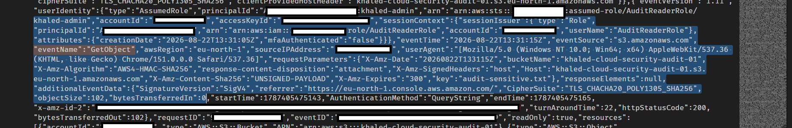

# AWS-06 — CloudTrail S3 Data-Event Logging Gap

## Finding Information

| Field | Value |
|---|---|
| **Finding ID** | AWS-06 |
| **Category** | Logging, Monitoring & Detection Visibility |
| **Severity** | Medium |
| **Status** | Remediated / Validated |
| **AWS Services** | AWS CloudTrail, Amazon S3, IAM |
| **Date Identified** | 2026-08-22 |
| **Security Principle** | Security Visibility / Audit Logging / Detection Engineering |

---

## Executive Summary

A cloud-security assessment identified a monitoring gap around object-level access to the S3 bucket:

`khaled-cloud-security-audit-01`

A least-privileged role, `AuditReaderRole`, was able to read the synthetic object:

`audit-sensitive.txt`

The access was legitimate and intentionally generated for the lab. However, the initial CloudTrail Event History view showed management-plane activity while the S3 object read itself was not available there.

The cause was a logging-coverage gap: S3 object operations such as `GetObject` are **data events**, while the standard CloudTrail Event History view is focused on management events.

The issue was remediated by configuring a CloudTrail trail to capture S3 read data events for the audit bucket. The object read was repeated and the delivered CloudTrail record subsequently showed a successful `GetObject` event for `audit-sensitive.txt`.

The remediation converted an activity that was previously absent from the available audit evidence into recorded security telemetry suitable for investigation and detection use cases.

---

## 1. Objective

The objective was to determine whether access to a sensitive S3 object could be reconstructed from available CloudTrail telemetry.

The desired state was:

```text
AuditReaderRole
      |
      v
S3 GetObject
      |
      v
CloudTrail data-event logging
      |
      v
Recorded audit event
```

---

## 2. Controlled Access Identity

`AuditReaderRole` was configured with a deliberately narrow S3 policy.

The role could:

- list the designated audit bucket;
- retrieve objects from that bucket.

It did not require broad S3 administration.

### Evidence — Least-Privilege S3 Policy



### Evidence — Policy Attached to AuditReaderRole



---

## 3. Baseline Object Access

While operating as `AuditReaderRole`, the test object was successfully accessed:

`khaled-cloud-security-audit-01/audit-sensitive.txt`

### Evidence — Object Access Generated



This created the activity that the monitoring controls were expected to capture.

---

## 4. Visibility Gap

CloudTrail Event History was reviewed after the baseline access.

The view showed management events such as role switching and bucket-management activity, but the expected S3 `GetObject` operation was not present in the management-event history.

### Evidence — GetObject Missing from Event History



### Technical Interpretation

The gap existed because:

```text
CloudTrail Event History
        |
        +--> Management events
        |
        X
   S3 object GetObject
        |
        +--> Data event
```

This is an important distinction for SOC investigations: enabling CloudTrail does not automatically mean every resource-level action is represented in the same event view.

---

## 5. Security Impact

Without S3 data-event logging, investigators may lack object-level evidence needed to answer questions such as:

- Who accessed a sensitive object?
- Which role performed the read?
- Which bucket and key were accessed?
- Was the request successful?
- When did the access occur?
- Was the event read-only or modifying activity?

This weakens investigation, threat hunting, forensic reconstruction, and detection coverage.

### Severity — Medium

The finding was rated **Medium** because it represented a meaningful visibility gap rather than direct unauthorized access. In a production environment containing sensitive or regulated data, severity may increase depending on monitoring requirements and data classification.

---

## 6. Remediation

A CloudTrail trail was configured to capture S3 data events for the audit workload.

The relevant configuration enabled **read data events** for the S3 resource under assessment.

### Evidence — S3 Data-Event Logging Enabled



The lab intentionally focused on object-read visibility to minimize unnecessary event volume.

---

## 7. Post-Remediation Test

After data-event logging was enabled, `AuditReaderRole` accessed `audit-sensitive.txt` again.

### Evidence — Object Access Repeated



This generated a second controlled access event after the monitoring control was enabled.

---

## 8. CloudTrail Validation

The delivered CloudTrail data event contained the expected indicators for the S3 read operation.

The captured record showed fields including:

```text
eventSource: s3.amazonaws.com
eventName: GetObject
role: AuditReaderRole
bucketName: khaled-cloud-security-audit-01
key: audit-sensitive.txt
httpStatusCode: 200
readOnly: true
```

### Evidence — GetObject Data Event Confirmed



This established a complete audit trail linking the assumed role to the successful object read.

---

## 9. Before vs. After

| Validation Item | Before | After |
|---|---:|---:|
| Controlled S3 read succeeds | ✅ | ✅ |
| CloudTrail management activity available | ✅ | ✅ |
| `GetObject` visible in baseline Event History | ❌ | N/A |
| S3 read data-event logging configured | ❌ | ✅ |
| Successful `GetObject` event captured | ❌ | ✅ |
| Bucket name recorded | ❌ | ✅ |
| Object key recorded | ❌ | ✅ |
| Role identity recorded | ❌ | ✅ |
| HTTP success status available | ❌ | ✅ |

---

## 10. Detection Value

The remediated telemetry can support detections and investigations involving:

- unusual reads from sensitive S3 buckets;
- unexpected roles accessing protected objects;
- access outside normal operating hours;
- high-volume object retrieval;
- anomalous source IP addresses;
- access to specifically monitored object prefixes;
- compromised-role investigations.

Example conceptual detection:

```text
IF
    eventSource == "s3.amazonaws.com"
AND eventName == "GetObject"
AND bucketName == "<sensitive-bucket>"
AND principal NOT IN expected_readers

THEN
    investigate unexpected S3 object access
```

---

## 11. Final Monitoring Model

```text
BEFORE

AuditReaderRole
      |
      v
GetObject
      |
      X
Object read absent from available
management-event history


AFTER

AuditReaderRole
      |
      v
GetObject
      |
      v
CloudTrail S3 Data Event
      |
      v
Recorded:
- Role
- Bucket
- Object key
- Event name
- Timestamp
- Request outcome
```

---

## 12. Validation Outcome

- [x] Least-privileged test identity created
- [x] Controlled S3 read generated
- [x] Baseline monitoring gap documented
- [x] S3 read data-event logging enabled
- [x] Object access repeated
- [x] CloudTrail log delivered
- [x] `GetObject` event identified
- [x] Role, bucket, object and successful request confirmed

### Final Status

**Remediated / Validated**

---

## 13. Security Principles Demonstrated

- Cloud Logging Assessment
- Security Telemetry Engineering
- Detection Visibility
- Audit Trail Validation
- Least Privilege
- Incident Investigation Readiness
- Data-Plane Monitoring
- Before/After Remediation Testing

---

## 14. Lessons Learned

AWS-06 demonstrates an important distinction between having CloudTrail available and having the telemetry required for a specific investigation.

```text
CloudTrail enabled
      does not automatically mean
all resource activity is logged
```

For S3, management-plane visibility and object-level data-event visibility are different controls.

A monitoring design should therefore begin with the activity that defenders need to observe and verify that the required event category is actually being collected.

The final `GetObject` record provided direct evidence that the monitoring gap was successfully closed.

---

## Evidence Index

| Evidence | Description |
|---|---|
| `01_before_AuditReaderS3Policy.png` | Least-privilege S3 policy used by the test role |
| `02_before_AuditReaderRole_policy_attached.png` | Policy attached to `AuditReaderRole` |
| `03_before_object_access_generated.png` | Baseline access to `audit-sensitive.txt` |
| `04_before_getobject_not_visible_in_event_history.png` | Management Event History without the object-level `GetObject` |
| `05_after_s3_data_event_logging_enabled.png` | S3 read data-event logging configuration |
| `06_after_object_access_generated.png` | Controlled access repeated after logging was enabled |
| `07_after_getobject_data_event_confirmed.png` | CloudTrail record showing successful `GetObject` activity |

---

## Repository Contents

```text
AWS-06/
├── README.md
├── evidence/
│   ├── 01_before_AuditReaderS3Policy.png
│   ├── 02_before_AuditReaderRole_policy_attached.png
│   ├── 03_before_object_access_generated.png
│   ├── 04_before_getobject_not_visible_in_event_history.png
│   ├── 05_after_s3_data_event_logging_enabled.png
│   ├── 06_after_object_access_generated.png
│   └── 07_after_getobject_data_event_confirmed.png
└── policies/
    └── AuditReaderS3Policy.json
```

---

## Ethical Scope

All activity was performed in a personally controlled AWS lab using synthetic data.

No production systems, customer data, third-party infrastructure, or unauthorized resources were accessed.

CloudTrail data-event logging was enabled only for the controlled assessment workflow and should be reviewed or disabled after the lab to avoid unnecessary event volume and cost.

Before public publication, screenshots should be sanitized to remove account IDs, access-key identifiers, source IP addresses, account-specific ARNs, and other environment-specific metadata.
